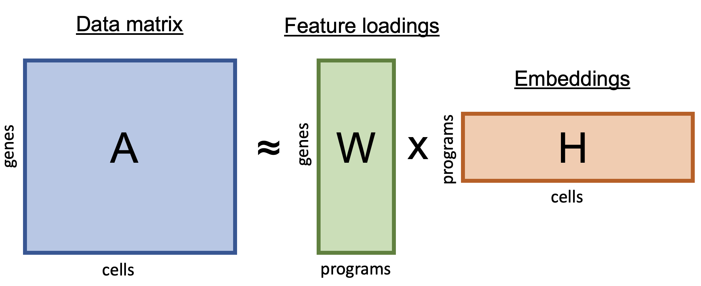

Non-negative matrix factorization is a tool for the analysis of high dimensional data that allows extracting sparse and meaningful features from a set of non-negative data vectors. It is well suited for decomposing scRNA-seq data, effectively reducing large complex matrices ($10^4$ of genes times $10^5$ of cells) into a few interpretable gene programs. It has been especially used to extract recurrent gene programs in cancer cells (see e.g. [Barkely et al. (2022)](https://www.nature.com/articles/s41588-022-01141-9) and [Gavish et al. (2023)](https://www.nature.com/articles/s41586-023-06130-4)), which are otherwise difficult to integrated and analyse jointly.

{width=75%}


Here, to illustrate the methods implemented in the [GeneNMF package](https://github.com/carmonalab/GeneNMF), we will apply NMF on a single-cell cell dataset of human PBMCs - a downsampled version of the dataset published by [Hao et al. (2021)](https://pubmed.ncbi.nlm.nih.gov/34062119/). 

# Set up the enviroment

Here are some packages you'll need for this demo:
```{r echo=F, results=F, warning=F, message=F}
renv::restore()
```

```{r results=F, warning=F, message=F}
library(Seurat)
library(ggplot2)
library(UCell)
library(patchwork)
library(Matrix)
library(RcppML)
library(dendextend)
library(viridis)

remotes::install_github("carmonalab/GeneNMF")
library(GeneNMF)
```

Then download the test dataset for this demo.
```{r}
ddir <- "input"
data.path <- sprintf("%s/pbmc_multimodal.downsampled20k.seurat.rds", ddir)

if (!file.exists(data.path)) {
    dir.create(ddir)
    dataUrl <- "https://www.dropbox.com/s/akzu3hp4uz2mpkv/pbmc_multimodal.downsampled20k.seurat.rds?dl=1"
    download.file(dataUrl, data.path)
}

seu <- readRDS(data.path)
```

# NMF for dimensionality reduction

NMF can be applied to reduce the dimensionality of the data from tens of thousand of genes to a few dimensions (similarly to PCA). With the `RunNMF()` function, it can be directly applied on a Seurat object, and it will save the NMF results as a new dimensionality reduction.

```{r results=F, message=F, warning=F}
ndim <- 15

seu <- FindVariableFeatures(seu, nfeatures = 1000)
seu <- RunNMF(seu, k = ndim, assay="SCT")
```

```{r}
seu@reductions$NMF
```

We can also further reduced the dimensionality to 2 dimensions using UMAP; in this space we can visualize all cells in a single plot.

```{r  results=F, message=F, warning=F}
seu <- RunUMAP(seu, reduction = "NMF", dims=1:ndim, reduction.name = "NMF_UMAP", reduction.key = "nmfUMAP_")
```

```{r}
DimPlot(seu, reduction = "NMF_UMAP", group.by = "celltype.l1", label=T) + theme(aspect.ratio = 1,
                                                            axis.text = element_blank(),
    axis.title = element_blank(),
    axis.ticks = element_blank()) + ggtitle("NMF UMAP") + NoLegend()

```

# Consistent NMF programs across multiple samples

Identification of robust gene programs requires their detection across samples and variability of input parameters. Perhaps the most crucial parameter to NMF is the dimensionality `k`, which corresponds to the number of programs of the low-dimensional matrix. To determine robust programs, we can run NMF over multiple numbers of `k` and determine programs that are consistenly found across these runs. The `multiNMF()` function automatically performs NMF over a list of samples and for multiple values of `k`:

```{r message=F, results=F, warning=F}
seu.list <- SplitObject(seu, split.by = "donor")

nmf.res <- multiNMF(seu.list, assay="SCT", slot="data", k=4:9, L1=c(0,0),
                    do_centering=TRUE, calculate_hvg = TRUE, nfeatures = 2000,
                    exclude_ribo_mito=FALSE)
```


We can now compare the gene programs identified over multiple samples and numbers of `k` and inspect their similarity. It can be useful to visualize pairwise similarity (Jaccard Index) between gene programs:

```{r fig.width=25, fig.height=25}
ph <- getNMFheatmap(nmf.res, method=0.5, max.genes=50,
                                    hclust.method="ward.D2",
                                    jaccard.cutoff = c(0,0.8))
```

We can see "blocks" corresponding to gene programs of high similarity across datasets and values of `k`. We can then cut the similarity tree at a given height to find blocks of similar programs and derive consensus gene signatures for each block. For example, here we cut the tree to the height corresponding to 10 clusters of programs (which we can call meta-programs or MPs):

```{r fig.width=30, fig.height=5}
nprograms = 10
nmf.genes <- getNMFgenesConsensus(nmf.res, method=0.5, max.genes=50,
                                    hclust.method="ward.D2", nprograms=nprograms,
                                    min.confidence=0.3,
                                    plot.tree=TRUE, return.tree=FALSE)
```

We can also extract the "coverage" for consensus meta-programs; i.e. in what fraction of samples it was detected. On this dataset, all programs except Program10 were found in all samples.

```{r}
nmf.cov <- getNMFgenesConsensus(nmf.res, method=0.5, max.genes=50,
                                    hclust.method="ward.D2", nprograms=nprograms,
                                    min.confidence=0.3, plot.tree = FALSE,
                                    return.coverage = TRUE)

t(as.data.frame(nmf.cov))

```

What are the genes driving each program?
```{r}
t(as.data.frame(lapply(nmf.genes, head)))
```

# Intepretation of gene programs by GSEA

To aid the intepretation of gene programs, we can compare them to known signatures from public databases. The `runGSEA()` function can be useful to scan msigDB and evaluate the overlap of detected gene programs with signatures in the databases. Here we compare to the "C8" category (cell type signature gene sets); but other classes such as "H" (hallmark gene sets) may be more relevant in other contexts.

```{r results=F, warning=F, message=F}
library(msigdbr)
library(fgsea)
```

```{r}
top_p <- lapply(nmf.genes, function(program) {
  runGSEA(program, universe=rownames(seu), category = "C8")
})
```

For example, Program 1 appears to correlate significantly with a B cell signature:
```{r}
head(top_p$Program1)
```

# Signature scores for gene programs

A simple way to evaluate gene programs learned from the data is to calculate gene signature scores with the `UCell` package.

```{r}
seu <- AddModuleScore_UCell(seu, features = nmf.genes, assay="SCT", ncores=4, name = "")
```

```{r fig.width=15}
FeaturePlot(seu, features=names(nmf.genes), ncol=5) & theme(aspect.ratio = 1,
                                                            axis.text = element_blank(),
    axis.title = element_blank(),
    axis.ticks = element_blank())

```

We can see how many of the programs are enriched in specific cell subtypes (cell type annotation from the original study).

```{r fig.width=15}
VlnPlot(seu, features=names(nmf.genes), group.by = "celltype.l1",
        pt.size = 0, ncol=5)
```

# Signature scores to define integrated space

Individual cells can now be represented in terms of their gene program scores. Importantly, here the gene programs were learned as a consensus of gene programs found across multiple samples -- as opposed to calculating NMF once on the whole dataset. This can be an effective strategy to mitigate batch effects, as robust gene programs (aka metaprograms) are a consensus of gene programs consistently found across individual samples. Let's store these coordinates in the Seurat object: 
```{r}
matrix <- seu@meta.data[,names(nmf.genes)]
dimred <- scale(matrix)

colnames(dimred) <- paste0("NMF_",seq(1, ncol(dimred)))
#New dim reduction
seu@reductions[["NMFsignatures"]] <- new("DimReduc",
                                         cell.embeddings = dimred,
                                         assay.used = "RNA",
                                         key = "NMF_",
                                         global = FALSE)
```


We can also use these scores to generate a UMAP representation and visualize the data in 2D:

```{r warning=F, results=F, message=F}
set.seed(123)
seu <- RunUMAP(seu, reduction="NMFsignatures", dims=1:length(seu@reductions[["NMFsignatures"]]),
               metric = "euclidean", reduction.name = "umap_NMF")
```

How do the signature scores for the consensus programs look like in the combined space?
```{r fig.width=15, fig.height=10, warning=F, message=F}
FeaturePlot(seu, features = names(nmf.genes), reduction = "umap_NMF", ncol=4) &
  scale_color_viridis(option="B") &
   theme(aspect.ratio = 1, axis.text=element_blank(), axis.ticks=element_blank())
```

# Final remarks

NMF can be a powerful tool to extract gene programs for scRNA-seq data in an unbiased manner. Because it is calculated for each sample separately, it bypasses the need to perform batch effect correction to analyse samples jointly. This aspect makes it particularly interesting for the analysis of gene programs in cancer cells (see e.g. [Barkely et al. (2022)](https://www.nature.com/articles/s41588-022-01141-9) and [Gavish et al. (2023)](https://www.nature.com/articles/s41586-023-06130-4). 

# References

* GeneNMF package - [LINK](https://github.com/carmonalab/GeneNMF)
* We use the ultra-fast RcppML method for NMF - [LINK](https://cran.r-project.org/web/packages/RcppML/vignettes/RcppML.html)

